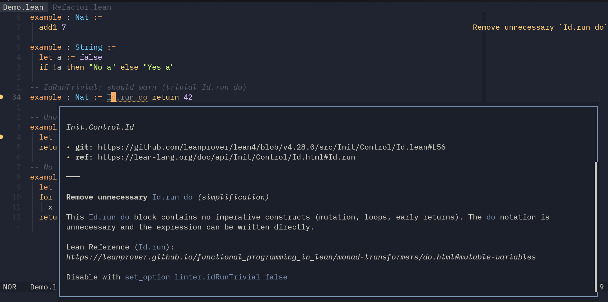

# Heron

**Refactoring and lint framework for [Lean 4](https://github.com/leanprover/lean4).**

Watches over _consistency and maintainability_ of large Lean projects by providing two kinds of rules:

- **Checks** — visible diagnostics that underline problematic code and offer quick-fixes.
- **Refactors** — code actions that appear when you open the refactor menu on a selection.

The `Id.run` check in action.



## Usage

Add an import of Heron and enable all rules:

```lean
import Heron.Rules
set_option linter.heron true
```

### Checks

Checks show up automatically as underlined diagnostics around anti-patterns.

- Move your cursor to the underline to see a short message.
- Enable inline diagnostics in your editor settings to see inline labels.

See [`Heron/Check/`](./Heron/Check) for all available checks.

Less essential but still useful:

- Checks for deprecated patterns are shown with strike-through in supported editors
- Checks for unused patterns are shown dimmed.
- Click the light-bulb to apply the suggested fix.
- Hover to open a popup with detailed explanation.
- Detailed explanation may contain clickable URL link to the reference.

### Refactors

Refactors are invisible until you explicitly request them via the code action menu on a selection. They are intended for offering an easy way to users to _refactor idiomatic_ Lean code. Use checks for showing a clear diagnostic to the user that indicates anti-pattern.

See [`Heron/Refactor/`](./Heron/Refactor) for all available refactors.

### Disabling a Rule

```lean
set_option linter.testIntros false
```

## Development


_Named after the [Heron](https://en.wikipedia.org/wiki/Heron) bird that watches over lakes since `lake` (in turn named after "Lean make") is the name of the build tool for Lean._

### Adding New Rules

Check rules live in [`Heron/Check/`](./Heron/Check), refactor rules in [`Heron/Refactor/`](./Heron/Refactor). Each rule file contains:

- A match data struct describing what was detected
- A `detect` function that scans user source code
- A set of `replacements` to fix a single match
- Inline tests for false positives, replacements, and negatives

### Testing

Tests use compile-time assertion commands that verify rules at build time. Failures appear as errors in the build output.

`#assertCheck` verifies that a check rule transforms a command into the expected result:

```lean
#assertCheck testIntros in
example : Nat → Nat → True := by intro a; intro b; exact trivial
becomes `(command| example : Nat → Nat → True := by intro a b; exact trivial)
```

`#assertRefactor` does the same for refactor rules:

```lean
#assertRefactor inline in
example : Nat := myConst
becomes `(command| example : Nat := (42))
```

`#assertIgnore` verifies that a rule produces no edits for the given command:

```lean
#assertIgnore testRfl in
example (a : Nat) : a = a + 0 := by simp
```

## Installation

At the moment of writing, you need to use a patched Lean (for now): [`github:wvhulle/lean4`](https://github.com/wvhulle/lean4).

- For Nix users: Configure your Nix flake to use the patched Lean. You will need to add the repo as input to your flake and then reference the `lean` or `lake` package exported by it.
- For other users:
  1. Clone the patched Lean into `../lean4`
  2. Build with `cmake` as documented in its `README.md`
  3. Add `lake` to your path:
     ```bash
     export PATH="$PWD/../lean4/build/release/stage1/bin:$PATH"
     ```

Then add the Lake dependency:

```toml
[[require]]
name = "heron"
git = "https://codeberg.org/wvhulle/heron"
rev = "main"
```
